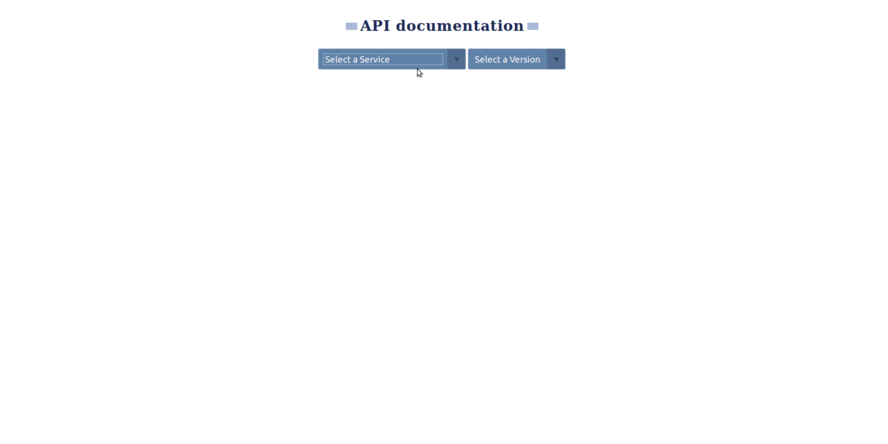

# OpenAPI-renderer



## Table of Contents

* [Summary](#summary)
* [Requirements](#requirements)
* [Setup](#setup)
    * [S3](#s3)
    * [Config](#config)
    * [Authentication](#authentication)
* [Run locally](#run-locally)
    * [The Docker way](#the-docker-way)

## Summary
* Automatically scans S3 bucket for `openapi.yml` files, and populates service/version dropdown menus
* Displays documentation using [ReDoc](https://github.com/Redocly/redoc), based on the selected service/version

**[⬆ back to top](#openapi-renderer)**

## Requirements

* Node.js **8.x**
* npm **6.9.0**

**[⬆ back to top](#openapi-renderer)**

## Setup
#### S3
Should have a bucket on [AWS S3](https://aws.amazon.com/ru/) with the following structure:
```
    [BUCKET]
    |__[STAGE]
       |__[SERVICE]
          |__[VERSION]
             |__[TIMESTAMP]
                |__openapi.yml
   
```
* `BUCKET` - bucket for documentation;
* `STAGE` - application development stage (example: dev, stage, prod);
* `SERVICE` - service name;
* `VERSION` - version;
* `TIMESTAMP` - timestamp;
* `openapi.yml` - .yml document;

**[⬆ back to top](#openapi-renderer)**

#### Config
- Required environment variables:
    * S3_AWS_ACCESS_KEY_ID
    * S3_AWS_SECRET_ACCESS_KEY
    * S3_BUCKET
- Optional environment variables (filled by default):
    * PORT                = 3000
    * CACHE_TTL           = 60000 //60s
    * CACHE_MAX_SIZE      = 50 * 1024 * 1024 //50mb
    * S3_API_VERSION      = '2006-03-01'
    * S3_OBJECTS_PER_PAGE = 1000
    * COOKIE_TTL          = 2592000000 //1month
    * AUTH_USER           = ""
    * AUTH_PASS           = ""

**[⬆ back to top](#openapi-renderer)**

#### Authentication
[Express-basic-auth](https://www.npmjs.com/package/express-basic-auth) - built-in middleware for authorization.
You can specify environment variables:
 - AUTH_USER
 - AUTH_PASS

 If you don't specify environment variables then authorization will be missing

**[⬆ back to top](#openapi-renderer)**

## Run locally
1. `npm install`
2. `cp .env.sample .env`
3. _(Modify .env)_
4. `npm start`

#### For debug:
```bash
DEBUG=openapi-renderer:* npm start
```

#### Starting the system:
```
localhost:3000
```

#### The Docker way
[velmie/openapi-renderer](https://hub.docker.com/r/velmie/openapi-renderer)
```
docker pull velmie/openapi-renderer:1.0.0

docker run -p 3000:80 -e S3_AWS_ACCESS_KEY_ID="" -e S3_AWS_SECRET_ACCESS_KEY="" -e S3_BUCKET="" velmie/openapi-renderer:1.0.0
```
- Required environment variables:
    * S3_AWS_ACCESS_KEY_ID
    * S3_AWS_SECRET_ACCESS_KEY
    * S3_BUCKET
- Optional environment variables for [authentication](#authentication):
    * AUTH_USER
    * AUTH_PASS

**[⬆ back to top](#openapi-renderer)**